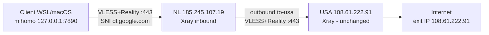

# Requirements

### Overview & Goals

Построить двух-hop прокси-цепочку: **Client (WSL/macOS) → Netherlands (185.245.107.19) → USA (108.61.222.91) → Internet**. Финальный внешний IP — USA. USA-сервер уже рабочий (Xray VLESS+Reality, TCP 443, SNI `dl.google.com`) и **не изменяется**. Netherlands — новый relay на standalone Xray-core, принимающий клиента по VLESS+Reality и пересылающий **весь** трафик на USA.

### Scope

**In Scope**
- Установка и настройка Xray на NL-сервере (`SSH_TUNNEL_NL=root@185.245.107.19`) официальным installer'ом XTLS.
- Генерация NL-ключей (`xray uuid`, `xray x25519`, `openssl rand -hex 8`) и конфига inbound VLESS+Reality :443 → outbound `to-usa` → USA, routing: весь трафик inbound → `to-usa`.
- Переключение локального клиента (mihomo-proxy-kit) на NL entrypoint с сохранением имени группы/ноды `USA`.
- Обновление private repo: `proxy.env` с NL credentials, `bin/` с тремя архивами mihomo v1.19.32, README.
- Проверки: exit IP `108.61.222.91`, маршрутизация AI-доменов через USA, rollback-процедуры.

**Out of Scope**
- Любые изменения на USA-сервере.
- 3x-ui (только standalone Xray-core).
- Изменение кода `install.sh` — текущая логика уже покрывает задачу (см. Technical Design).
- Публикация секретов (UUID/PRIVATE_KEY/PUBLIC_KEY/SHORT_ID) в логах и отчётах.

### Functional Requirements
1. NL Xray: inbound `0.0.0.0:443` VLESS+Reality (flow `xtls-rprx-vision`, target/SNI `dl.google.com`), outbound `to-usa` (VLESS+Reality к `108.61.222.91:443`, fingerprint `chrome`), routing: 100% трафика inbound → `to-usa`.
2. Перед записью конфига — backup существующего в `/usr/local/etc/xray/config.json.backup.YYYYMMDD-HHMMSS`; после записи — `chown nobody:nogroup`, `chmod 600`.
3. Валидация на NL: `xray run -test`, `systemctl is-active xray`, `ss -H -ltnp '( sport = :443 )'`, при проблемах `journalctl -u xray -n 50`.
4. `/root/nl-client-values.txt` (chmod 600): `SERVER_IP`, `UUID`, `PUBLIC_KEY`, `SHORT_ID`, `SERVER_NAME` — содержимое не печатать.
5. Клиентский `proxy.env`: `SERVER_IP/UUID/PUBLIC_KEY/SHORT_ID` = NL-значения, `REALITY_SERVER_NAME=dl.google.com`, плюс `EXPECTED_EXIT_IP=108.61.222.91` (критично, см. Technical Design).
6. Правила mihomo: список AI-доменов из task.md (openai, chatgpt, oaiusercontent, oaistatic, jetbrains.ai/cloud/com, grazie, anthropic, claude.*, console.anthropic) → USA; `GEOIP,PRIVATE,DIRECT,no-resolve`; `MATCH,USA`. Текущий `install.sh` генерирует именно этот набор (через группу `PROXY[USA]`).
7. Проверка: `curl -x http://127.0.0.1:7890 https://api.ipify.org` → `108.61.222.91`; в `mihomo.log` строки `api.anthropic.com / api.openai.com / chatgpt.com / api.jetbrains.ai ... using ...USA`.
8. Repo: `install.sh`, `proxy.env` (NL entrypoint), `README.md`, `bin/mihomo-{linux-amd64-compatible,darwin-arm64,darwin-amd64-compatible}-v1.19.32.gz`.

### Non-Functional Requirements
- Безопасность: секреты не выводятся в отчёт/лог; `nl-client-values.txt` и `xray/config.json` — `600`; repo остаётся private.
- Откат: USA не тронут; NL-конфиг восстанавливается из backup; клиент — из резервной копии старого `proxy.env`.
- SSH-команды без naked `exit` (всё внутри `bash -s`/subshell — существующий паттерн `setup-server.sh` это уже соблюдает).

# Technical Design

### Current Implementation

- **`install.sh`** (346 строк): читает `proxy.env`, генерирует `~/.config/mihomo/config.yaml` (нода `USA` типа vless+reality, группа `PROXY` → `USA`), правила уже совпадают со списком task.md, `MATCH,${FINAL_TARGET}` → `PROXY`. Проверяет exit IP против `EXPECTED_EXIT_IP` (по умолчанию = `SERVER_IP`). Поддерживает RU-релей (`RU_*`), который нам не нужен.
- **`server/setup-server.sh`** (108 строк): по SSH ставит Xray официальным installer'ом, генерирует UUID/x25519/shortId, пишет конфиг, открывает 443, включает BBR, печатает блок `proxy.env`. Уже есть режим `CHAIN_USA=1`, но он роутит на USA **только AI-домены**, остальное — `direct`. Задаче нужен режим «весь трафик → USA».
- **`server/xray-config.json`**: дамп рабочего USA-конфига — эталон полей (`"network": "tcp"`, `realitySettings` с `target`/`serverNames`/`privateKey`/`shortIds`).
- **`proxy.env`**: сейчас USA напрямую + `SSH_TUNNEL_SERVER=root@108.61.222.91`, `SSH_TUNNEL_NL=root@185.245.107.19`, заглушки `RU_*` (TEST-NET, надо очистить).
- **`bin/`**: пусто (только `.gitkeep`); linux-архив лежит в корне repo. Релиз mihomo `v1.19.32` существует, darwin-архивы доступны на GitHub (проверено).

### Key Decisions

1. **NL-настройка — расширением `setup-server.sh` новым режимом `CHAIN_ALL=1`**, а не ручными SSH-командами. Паттерн уже есть (`CHAIN_USA`), результат воспроизводим, секреты не проходят через чат.
2. **Routing на NL: catch-all** — inbound получает `tag: "vless-reality-in"`, правило `{"type":"field","inboundTag":["vless-reality-in"],"outboundTag":"to-usa"}`. Отличие от `CHAIN_USA`: никакого `freedom direct` для обычного трафика.
3. **`install.sh` не трогаем** — меняются только значения `proxy.env`. Критично: задать `EXPECTED_EXIT_IP=108.61.222.91`, иначе проверка в `install.sh` упадёт с кодом 6 (default = `SERVER_IP` = NL). Также очистить `RU_SERVER_IP` и прочие `RU_*`.
4. **`"network": "tcp"`** в NL-конфиге — поле подтверждено рабочим USA-конфигом. В новых версиях Xray встречается переименование в `raw` (*unsure* — документация недоступна из сессии); страховка — `xray run -test` до restart, при отказе заменить на `raw`.
5. **Источник USA-значений — текущий `proxy.env`** (UUID/PUBLIC_KEY/SHORT_ID), читается скриптом ДО перезаписи; старый `proxy.env` копируется в `proxy.env.usa-backup` (не коммитится) для rollback.
6. **Fingerprint**: NL→USA outbound — `chrome` (по спецификации task.md); клиент→NL остаётся `firefox` (дефолт `CLIENT_FINGERPRINT`, известная проблема PQ ClientHello у chrome).

### Proposed Changes

**`server/setup-server.sh`** — новый режим `CHAIN_ALL=1` (env: `U_IP`, `U_ID`, `U_PK`, `U_SID`, `U_SNI` как в `CHAIN_USA`):
- Backup существующего `$CFG` → `$CFG.backup.$(date +%Y%m%d-%H%M%S)` (если файл есть).
- Outbound-ы: `to-usa` (vless: address `$U_IP:443`, user id `$U_ID`, flow `xtls-rprx-vision`, encryption `none`; streamSettings: network `tcp`, security `reality`, realitySettings: serverName `$U_SNI`, fingerprint `chrome`, publicKey `$U_PK`, shortId `$U_SID`) + `direct` (freedom, запасной).
- Routing: catch-all `inboundTag:["vless-reality-in"]` → `to-usa`.
- После записи: `xray run -test -config $CFG` → `chown nobody:nogroup` + `chmod 600` → `systemctl restart xray` → проверки `is-active` и `ss -H -ltnp '( sport = :443 )'`.
- Записать `/root/nl-client-values.txt` (chmod 600), в stdout печатать только факт успеха без значений.

**`proxy.env`** (перезаписывается после успешной проверки NL):
- `SERVER_IP=185.245.107.19`, `UUID/PUBLIC_KEY/SHORT_ID` — NL-значения (скрипт читает их по SSH из `/root/nl-client-values.txt`, не печатая в чат).
- `EXPECTED_EXIT_IP=108.61.222.91`, `REALITY_SERVER_NAME=dl.google.com`, `PROXY_PORT=7890`.
- Удалить/закомментировать `RU_*`; сохранить `SSH_TUNNEL_SERVER`/`SSH_TUNNEL_NL`.

**Repo**: `mihomo-linux-amd64-compatible-v1.19.32.gz` → в `bin/`; докачать `mihomo-darwin-arm64-v1.19.32.gz` и `mihomo-darwin-amd64-compatible-v1.19.32.gz` из релиза MetaCubeX/mihomo `v1.19.32`; обновить README (схема NL→USA, новый `proxy.env`, rollback).

### Data Models / Contracts

NL `/usr/local/etc/xray/config.json` (скелет, без секретов):
```json
{
  "log": {"loglevel": "warning"},
  "inbounds": [{
    "tag": "vless-reality-in", "listen": "0.0.0.0", "port": 443, "protocol": "vless",
    "settings": {"clients": [{"id": "<NL_UUID>", "flow": "xtls-rprx-vision"}], "decryption": "none"},
    "streamSettings": {"network": "tcp", "security": "reality",
      "realitySettings": {"show": false, "target": "dl.google.com:443", "xver": 0,
        "serverNames": ["dl.google.com"], "privateKey": "<NL_PRIVATE_KEY>", "shortIds": ["<NL_SHORT_ID>"]}}
  }],
  "outbounds": [
    {"tag": "to-usa", "protocol": "vless",
     "settings": {"vnext": [{"address": "108.61.222.91", "port": 443,
        "users": [{"id": "<USA_UUID>", "flow": "xtls-rprx-vision", "encryption": "none"}]}]},
     "streamSettings": {"network": "tcp", "security": "reality",
       "realitySettings": {"serverName": "dl.google.com", "fingerprint": "chrome",
         "publicKey": "<USA_PUBLIC_KEY>", "shortId": "<USA_SHORT_ID>"}}},
    {"tag": "direct", "protocol": "freedom"}
  ],
  "routing": {"rules": [{"type": "field", "inboundTag": ["vless-reality-in"], "outboundTag": "to-usa"}]}
}
```

`/root/nl-client-values.txt` (chmod 600): `SERVER_IP` / `UUID` / `PUBLIC_KEY` / `SHORT_ID` / `SERVER_NAME=dl.google.com`.

### Architecture Diagram



### Risks
- **`network: tcp` vs `raw`**: mitigated — `xray run -test` до restart; fallback на `raw` при отказе (*unsure*, помечено).
- **`EXPECTED_EXIT_IP` mismatch** (код 6 в install.sh): решается явным `EXPECTED_EXIT_IP=108.61.222.91` в `proxy.env`.
- **Занятый :443 на NL**: `setup-server.sh` уже прерывается с диагностикой (exit 10) до установки.
- **Остаточные `RU_*`-заглушки** сломали бы маршрутизацию: обязательная очистка в `proxy.env`.
- **Утечка секретов**: значения передаются файлом на сервере и читаются по SSH в переменные; в отчётах — только факты успеха.
- **chrome fingerprint NL→USA**: требование спеки; при нестабильности handshake fallback на `firefox` (однострочная правка конфига NL).

# Testing

### Validation Approach
Ручные проверочные команды на трёх уровнях: NL-сервер (по SSH), цепочка end-to-end с клиента, маршрутизация AI-доменов по логу mihomo. Автотесты не добавляются (ops-задача, shell).

### Key Scenarios
1. **NL config valid**: `xray run -test -config /usr/local/etc/xray/config.json` → OK (до restart).
2. **NL service up**: `systemctl is-active xray` = active; `ss -H -ltnp '( sport = :443 )'` показывает xray.
3. **Two-hop exit IP**: `curl -x http://127.0.0.1:7890 https://api.ipify.org` → ровно `108.61.222.91` (не NL IP) — доказывает Client→NL→USA.
4. **AI-домены через USA**: `tail -F ~/.config/mihomo/mihomo.log | grep --line-buffered -iE 'anthropic|claude|openai|chatgpt|jetbrains|grazie|USA'` + запросы к `api.openai.com`, `claude.ai`, `api.jetbrains.ai` → строки `... using PROXY[USA]`.
5. **Install-гейт**: `bash ./install.sh` завершается `Verified exit IP: 108.61.222.91` (проверяет, что `EXPECTED_EXIT_IP` задан верно).

### Edge Cases
- `xray run -test` отклоняет `network: tcp` → заменить на `raw`, повторить test.
- Порт 443 на NL занят → скрипт останавливается (exit 10), разрешить владельца порта вручную.
- Клиентский curl вернул NL IP → значит routing на NL ушёл в `direct` вместо `to-usa`; проверить routing-правило и `journalctl -u xray`.
- Handshake-ошибки NL→USA в `journalctl -u xray` → сменить fingerprint `chrome`→`firefox` в outbound.

### Rollback Verification
- **NL сломан**: `cp /usr/local/etc/xray/config.json.backup.* /usr/local/etc/xray/config.json` (если был), либо `systemctl stop xray`; USA не затронут.
- **Клиент сломан**: восстановить `proxy.env.usa-backup` → `proxy.env`, `bash ./install.sh`, подтвердить `curl -x http://127.0.0.1:7890 https://api.ipify.org` → `108.61.222.91` (прямой USA).

### Test Changes
Не требуются — валидация командами из task.md (пп. 5, 9, 10).

# Delivery Steps

### ✓ Step 1: Add CHAIN_ALL relay mode to server/setup-server.sh
`server/setup-server.sh` умеет режим `CHAIN_ALL=1`: весь трафик NL-inbound уходит в outbound `to-usa` на USA.

- Добавить ветку `CHAIN_ALL=1` (env: `U_IP`, `U_ID`, `U_PK`, `U_SID`, `U_SNI=dl.google.com`) по образцу существующей `CHAIN_USA`.
- Конфиг: inbound tag `vless-reality-in` на `0.0.0.0:443`, outbound `to-usa` (vless+reality, fingerprint `chrome`), запасной `direct` freedom.
- Routing catch-all: `inboundTag:["vless-reality-in"]` → `to-usa` (без domain-фильтров).
- Добавить backup существующего конфига в `config.json.backup.YYYYMMDD-HHMMSS` перед записью.
- После записи: `xray run -test`, `chown nobody:nogroup`, `chmod 600`, restart, проверки `is-active` + `ss` на :443.
- Записывать `/root/nl-client-values.txt` (chmod 600); в stdout — без секретов.

### ✓ Step 2: Provision Netherlands server as relay to USA
NL-сервер (185.245.107.19) поднят как relay: xray active, слушает :443, весь трафик пересылает на USA.

- Прочитать USA-значения (`UUID`, `PUBLIC_KEY`, `SHORT_ID`) из текущего `proxy.env`; сохранить копию в `proxy.env.usa-backup` для rollback.
- Запустить `CHAIN_ALL=1 U_IP=108.61.222.91 U_ID=... U_PK=... U_SID=... bash server/setup-server.sh root@185.245.107.19` (SSH-цель из `SSH_TUNNEL_NL`).
- Проверить на NL: `xray run -test` пройден, `systemctl is-active xray`, `ss -H -ltnp '( sport = :443 )'`.
- При отказе config test на `network: tcp` — переключить на `raw` и повторить.
- Убедиться, что `/root/nl-client-values.txt` существует с правами 600 (содержимое не печатать).

### ✓ Step 3: Switch local mihomo client to NL entrypoint and verify two-hop chain
Локальный клиент подключается к NL, `curl -x http://127.0.0.1:7890 https://api.ipify.org` возвращает `108.61.222.91`.

- Перезаписать `proxy.env`: NL `SERVER_IP/UUID/PUBLIC_KEY/SHORT_ID` (прочитать по SSH из `/root/nl-client-values.txt`, не выводя), `EXPECTED_EXIT_IP=108.61.222.91`, очистить `RU_*`, сохранить `SSH_TUNNEL_*`.
- Запустить `bash ./install.sh` — ожидать `Verified exit IP: 108.61.222.91`.
- Проверить маршрутизацию AI-доменов: grep лога по `anthropic|claude|openai|chatgpt|jetbrains|grazie` → строки `using PROXY[USA]`.
- При сбое — rollback: вернуть `proxy.env.usa-backup`, повторить `install.sh`, подтвердить прямой выход USA.

### ✓ Step 4: Update private repo contents (bin/, proxy.env, README)
Репозиторий готов к раздаче: `git clone` → `bash ./install.sh` поднимает клиента через NL entrypoint.

- Переместить `mihomo-linux-amd64-compatible-v1.19.32.gz` в `bin/`; скачать из релиза MetaCubeX/mihomo `v1.19.32` архивы `mihomo-darwin-arm64-v1.19.32.gz` и `mihomo-darwin-amd64-compatible-v1.19.32.gz` в `bin/`.
- Убедиться, что `proxy.env` содержит NL entrypoint (не USA) — он и есть рабочий файл после Stage 3.
- Обновить `README.md`: схема Client→NL→USA, новые параметры `proxy.env` (вкл. `EXPECTED_EXIT_IP`), проверка exit IP и rollback-инструкции.
- Проверить состав repo по чек-листу task.md п.11: `install.sh`, `proxy.env`, `README.md`, три архива в `bin/`.